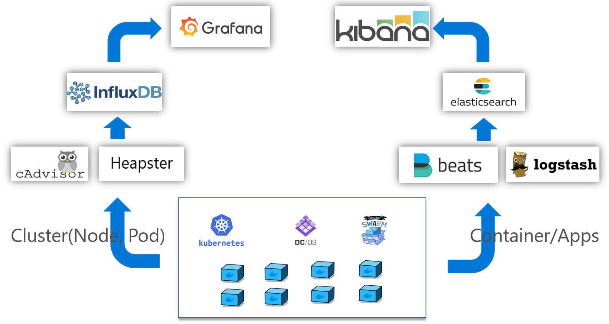

# DevOps Open Source Solution for Azure China

## Overview

DevOps open source solution helps user to set up container-based cluster with orchestrator(including Kubernetes, DC/OS, Docker Swarm) supported quickly and easily on Azure China. Also this solution provides CI/CD pipeline enabled by Jenkins and plugins, and monitoring stacks(ELK + Grafana) reference implementation. It includes several parts:

* Container-based Clusters: Created by [acs-engine](https://github.com/Azure/acs-engine), users could choose DC/OS, Kubernetes, or Swarm as the orchestrator. We choose Kubernetes as the reference implementation in this project
* Private Docker registry: store custom images
* CI/CD Pipeline: CI/CD pipeline implementation based on Jenkine and plugins
* Monitoring Stack: Cluster(node + pod) resource and container/app monitoring and log analytics

## Architecture
* K8S cluster architecture deployed with acs-engine

* CI/CD with Open Source Toolchain:

* Monitor reference architcture:

## User guides

If you'd like to deploy from beginning, please follow below holistic steps. If you already have some components being used in your project, you could pick the missing parts from this project and deploy it separately.

* [Deploy a Kubernetes cluster using acs-engine](README.md) - shows you how to use the acs-engine to build container-based clusters.
* [Deploy a Private docker registry](private-docker-registry/README.md) - describes how to deploy a secure private docker registry
* [CI/CD pipeline](cicd/README.md) - shows how to deploy a Jenkins master and create pipeline which includes below 5 steps:
    * Check out git repro
    * Build Docker images 
    * Push docker image to private docker registry 
    * Test and validation 
    * Deploy to Kubernetes 
* [Monitor](monitoring/README.md) - shows how to set up monitoring stacks
    * Heapster + Influxdb + Grafana
    * Beats + Logstash + Elasticsearch + Kibana

## Contributing

This project welcomes contributions and suggestions.  Most contributions require you to agree to a
Contributor License Agreement (CLA) declaring that you have the right to, and actually do, grant us
the rights to use your contribution. For details, visit https://cla.microsoft.com.

When you submit a pull request, a CLA-bot will automatically determine whether you need to provide
a CLA and decorate the PR appropriately (e.g., label, comment). Simply follow the instructions
provided by the bot. You will only need to do this once across all repos using our CLA.

This project has adopted the [Microsoft Open Source Code of Conduct](https://opensource.microsoft.com/codeofconduct/).
For more information see the [Code of Conduct FAQ](https://opensource.microsoft.com/codeofconduct/faq/) or
contact [opencode@microsoft.com](mailto:opencode@microsoft.com) with any additional questions or comments.
