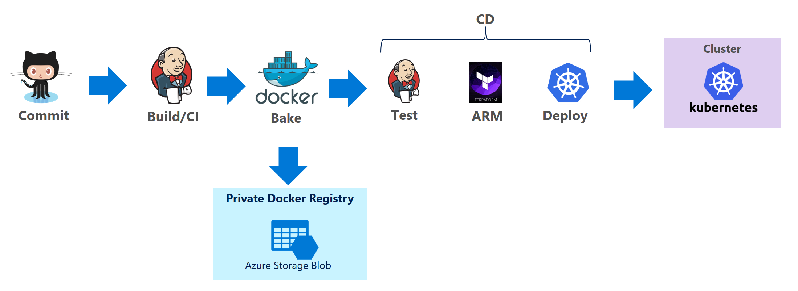

# DevOps开源解决方案

## 概览

此开源解决方案帮助用户快速搭建基于Azure容器技术的微服务和DevOps容器集群，并提供基于Jenkins的持续集成和持续部署管道，以及基于ELK和Grafana的监控和分析实现。主要包括下面几个组成部分：
* 容器集群: 使用[acs-engine](https://github.com/Azure/acs-engine)创建容器集群，用户可以选择DC/OS，Kubernetes，Swarm作为编排工具。acs-engine还会帮助您创建负载均衡，网络管理，安全和存储等相关组件，以及完成高可用性（Availability Set）等相关设置，使您可以在容器集群上方便地部署容器化应用。在这个项目中，我们选择Kubernetes作为参考实现
* 私有镜像仓库: 镜像仓库可以和容器编排引擎（如Kubernetes，Swarm, DC/OS）进行集成，用于存储自定义的镜像。此镜像仓库兼容Docker格式的镜像仓库，可以和Docker工具进行无缝迁移
* CI/CD管道: 基于Jenkins的持续集成和持续部署（CI/CD）管道实现
* 监控和日志: 包括集群资源（Node + Pod）以及容器（container）和应用（app）的监控及日志分析

## 架构

* 使用acs-engine部署的Kubernetes容器集群架构

* CI/CD开源解决方案：

* 监控和日志参考架构：

## 用户指南

此项目按模块化进行设计，每一部分都可以单独部署和使用。用户可以根据实际的需要，选择其中的某一部分单独进行部署。也可以按照下面的步骤从头搭建完整的devops开源解决方案。
* [使用acs-engine部署Kubernete集群](acs-engine/README_CN.md) - 描述如何使用acs-engine将一个容器集群文件转化成一组ARM模板，通过在Azure上部署这些模板建立一套基于Docker的容器服务集群。
* [创建私有镜像仓库](private-docker-registry/README_CN.md) - 描述如何在Azure上部署安全的私有镜像仓库
* [基于Jenkins的CI/CD管道实现](cicd/README_CN.md) - 展示如何ARM部署基于Jenkins的持续集成和持续部署（CI/CD）管道实现。目前的管道实现包括5个步骤：
    * 从GitHub迁出代码
    * 构建Docker镜像
    * 推送镜像到私有镜像参考 
    * 测试和验证
    * 发布到Kubernetes集群
* [基于ELK和Grafana的监控与日志分析实现](monitoring/README_CN.md) - 使用ARM模板在容器机器上部署下面的工具链：
 Heapster + Influxdb + Grafana（用于集群资源的监控，如对于Node/Pod的CPU，内存，网络等资源的监控）
**	Beats + Logstash + Elasticsearch + Kibana （用于容器/应用的日志收集和分析，以及服务状态的监控）

