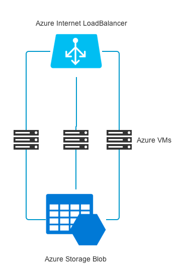

# Azure Docker Registry Template
This is a Azure ARM template to deploy Docker registry on Azure China. ***Some urls are hard coded to Azure China now, so this template is NOT workable on Global Azure.***

## Overview

This template deploy a simple Docker registry cluster based on Swarm Mode with TLS. The following is the architecture of the resources:

The default VM node is 2 and this value can be set when deploying.

## Usage

1. `mkdir -p /path/to/project`
2. `cd /path/to/project`
3. `git clone https://github.com/ChinaCloudGroup/azure-docker-registry-template.git`
4. `cd certs`
5. Create *.crt and *.key files and replace the default server.crt and server.key. These certificates and keys are used to secure the Docker registry.
6. `cd /path/to/project`
7. `./deploy-docker-registry.sh -n <resource_group_name> -l <location>` the location name should be one of `chinanorth` and `chinaeast`.

Then the Docker registry will be deployed.

