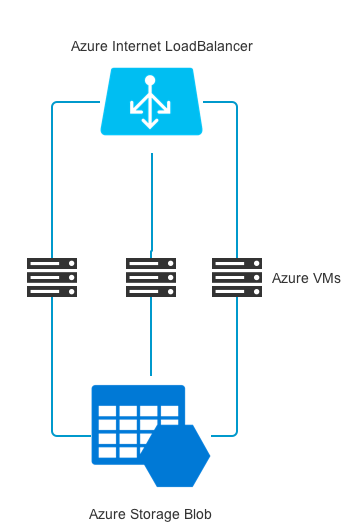

# 基于Azure的容器私有仓库
使用ARM模板在中国区Azure上部署容器私有仓库（Docker Private Registry）。***这个模板只适用于中国区Azure***

## 概述

运行模板会在Azure中使用Swarm模式搭建一个简单的容器仓库集群。使用的Azure资源和架构如下：



默认2个虚拟机节点，节点数可以在部署时在azuredeploy.parameters.json中更改。

## 前期准备
* 中国区Azure订阅
* Linux开发机，并安装[Azure CLI 2.0](https://docs.microsoft.com/en-us/cli/azure/install-azure-cli?view=azure-cli-latest)
* 使用Azure CLI登陆Azure订阅
```
$ az cloud set -n AzureChinaCloud
$ az login -u <username>
```
* 将代码下载到开发机上
```
$ mkdir -p /path/to/project
$ cd /path/to/project
$ git clone https://github.com/Azure/devops-sample-solution-for-azure-china.git
$ cd /path/to/project/devops-sample-solution-for-azure-china/private-docker-registry
```

## azuredeploy.parameters.json中的参数
| 参数         | 描述                                         | 默认值  |
|-------------------|----------------------------------------------------|----------------|
| adminUsername     | 虚拟机管理员用户名                                     | azureuser      |
| adminPassword     | 虚拟机管理员密码                   |                |
| dnsNameforLBIP    | 负载均衡的公有IP的DNS前缀                           | myhub01        |
| registryPort      | 仓库端口                                  | 5000           |
| numberOfInstances | 虚拟机实例数量                | 2              |
| vmSize            | 虚拟机实例大小                    | Standard_D2_v2 |
| sshRSAPublicKey   | 虚拟机SSH公钥 |                |

## A. 部署使用HTTP的仓库
为了测试需求，可以部署一个使用HTTP的仓库。这种方法是不安全的，因此并不推荐。
1. 编辑azuredeploy.parameters.json中的参数，运行命令
```
$ bash ./deploy-docker-registry.sh -n <resource_group_name> -l <location> -m mirror.kaiyuanshe.cn
```
2. 部署完成后，在每个需要访问仓库的客户端上，[进行配置](https://docs.docker.com/registry/insecure/#deploy-a-plain-http-registry) 。
例如，在Linux客户端上，编辑/etc/docker/daemon.json，添加 
```
{
  "insecure-registries" : ["<dns of the public IP created>:5000"]
}
```
然后使用`sudo service docker restart`命令重启容器。

也可以通过运行一下命令自动修改每个Kubernetes节点上的docker设置：
```
$ bash ./config-insecure-registry.sh -r <registry_fqdn> -r <k8s_master_fqdn> -u <k8s_ssh_user> -k <path_to_id_rsa>
```

## B. 用自签名证书部署使用TLS的仓库
用户可以[用自签名的证书部署使用TLS的仓库](https://docs.docker.com/registry/insecure/#use-self-signed-certificates)，这种方法比使用HTTP的仓库更安全，但是同样也只推荐在测试环境中使用。
1. 参考上面的链接生成自签名的证书，替换掉certs/server.crt和certs/server.key。
2. 编辑cloud-config-template.yml，将下面行的注释删掉
```
- REGISTRY_HTTP_TLS_CERTIFICATE=/certs/server.crt
- REGISTRY_HTTP_TLS_KEY=/certs/server.key
```
3. 编辑azuredeploy.parameters.json中的参数，运行命令
```
$ bash ./deploy-docker-registry.sh -n <resource_group_name> -l <location> -m mirror.kaiyuanshe.cn
```
4. 部署完成后，在每个需要访问仓库的客户端上，[进行配置](https://docs.docker.com/registry/insecure/#use-self-signed-certificates)。
例如，在Linux客户端上，将server.crt拷贝到/etc/docker/certs.d/< dns of the public IP created >:5000/server.crt

## C. 用CA证书部署使用TLS的仓库
推荐在产品环境中使用这种方法，具体步骤和使用自签名证书类似，但是不需要最后一步客户端的配置。


